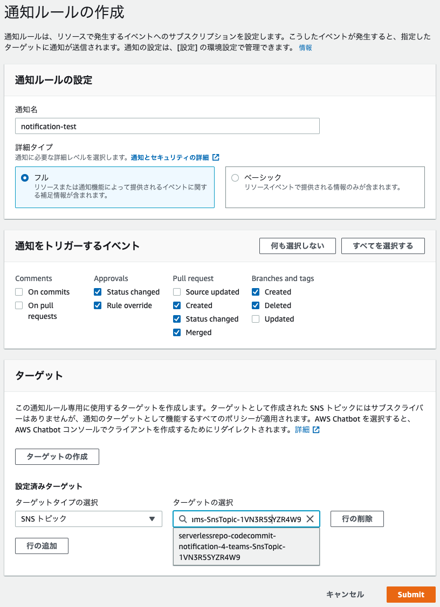

# AWS CodeCommit Notification 4 Teams

[](https://github.com/answer-d/aws-codecommit-notification-4-teams/actions/workflows/ut.yml)
[](https://github.com/answer-d/aws-codecommit-notification-4-teams/actions/workflows/it.yml)
[](https://github.com/answer-d/aws-codecommit-notification-4-teams/actions/workflows/release.yml)
[](https://github.com/answer-d/aws-codecommit-notification-4-teams/blob/main/LICENSE)

## Overview

CodeCommitで発生するイベントをTeams Incoming Webhookに通知する


## Getting Started

### 1. Teams Incoming Webhookを作成

- [Teams チャネルに受信 Webhook を追加する](https://docs.microsoft.com/ja-jp/microsoftteams/platform/webhooks-and-connectors/how-to/add-incoming-webhook#add-an-incoming-webhook-to-a-teams-channel)

### 2. デプロイ

- 以下のいずれかの方法でアプリケーションをデプロイ

1. AWS Serverless Application Repositoryでデプロイ (推奨)

    - [アプリケーションページ](https://serverlessrepo.aws.amazon.com/applications/ap-northeast-1/521635626865/codecommit-notification-4-teams) から
    - `HookUrl` に [Teams Incoming Webhookを作成](#teams-incoming-webhookを作成) で作成されたWebhookのURLをペーストして `デプロイ` を押す
2. CloudFormationでデプロイ

    - [Release](https://github.com/answer-d/aws-codecommit-notification-4-teams/releases) から最新の `packaged.yaml` を入手
    - CloudFormationスタックを作成

      ```console
      aws cloudformation deploy \
        --template-file packaged.yaml \
        --stack-name <<<YOUR STACK NAME>>> \
        --parameter-overrides HookUrl=<<<YOUR TEAMS INCOMING WEBHOOK URL>>> \
        --capabilities CAPABILITY_IAM
      ```

3. SAM CLIでデプロイ

    - [Deploy Application via SAM CLI](#deploy-application-via-sam-cli) 参照

### 3. CodeCommitで通知設定

- リポジトリの設定で通知をトリガーしたいイベントにチェック
- デプロイされたSNSトピックをターゲットに設定

  
  

### 4. CodeCommitリポジトリに変更を行う

- ブランチやPull Requestの作成などを行い、Webhookに通知が行われることを確認

## Created Resource

[template.yaml](template.yaml) 参照

## Configuration

### 通知メッセージに色を付ける

リポジトリごとに通知メッセージの色を設定可能

- before

  

- after

  

#### 設定方法

CodeCommitリポジトリに対して以下のタグを設定する

| key                        | value     |
| :------------------------- | :-------- |
| Notification4TeamsImageUrl | 画像のURL |

- 画像には以下の制限がある
  - タイプ：png/jpeg/gif(非アニメーション)
  - サイズ上限：1024\*1024

### 通知メッセージに画像を表示する

リポジトリごとに通知メッセージの画像を設定可能

- before

  

- after

  

#### 設定方法

CodeCommitリポジトリに対して以下のタグを設定する

| key                         | value                                         |
| :-------------------------- | :-------------------------------------------- |
| Notification4TeamsColorCode | `#` を含めない16進カラーコード(例: `007627` ) |

## Uninstall

CloudFormationスタックを削除

## License

[LICENSE](LICENSE) 参照

## Develop

### Deploy Application via SAM CLI

The Serverless Application Model Command Line Interface (SAM CLI) is an extension of the AWS CLI that adds functionality for building and testing Lambda applications. It uses Docker to run your functions in an Amazon Linux environment that matches Lambda. It can also emulate your application's build environment and API.

To use the SAM CLI, you need the following tools.

- SAM CLI - [Install the SAM CLI](https://docs.aws.amazon.com/serverless-application-model/latest/developerguide/serverless-sam-cli-install.html)
- [Python 3 installed](https://www.python.org/downloads/)
- Docker - [Install Docker community edition](https://hub.docker.com/search/?type=edition&offering=community)

To build and deploy your application for the first time, run the following in your shell:

```bash
sam build --use-container
sam deploy --guided
```

The first command will build the source of your application. The second command will package and deploy your application to AWS, with a series of prompts:

- **Stack Name**: The name of the stack to deploy to CloudFormation. This should be unique to your account and region, and a good starting point would be something matching your project name.
- **AWS Region**: The AWS region you want to deploy your app to.
- **Confirm changes before deploy**: If set to yes, any change sets will be shown to you before execution for manual review. If set to no, the AWS SAM CLI will automatically deploy application changes.
- **Allow SAM CLI IAM role creation**: Many AWS SAM templates, including this example, create AWS IAM roles required for the AWS Lambda function(s) included to access AWS services. By default, these are scoped down to minimum required permissions. To deploy an AWS CloudFormation stack which creates or modified IAM roles, the `CAPABILITY_IAM` value for `capabilities` must be provided. If permission isn't provided through this prompt, to deploy this example you must explicitly pass `--capabilities CAPABILITY_IAM` to the `sam deploy` command.
- **Save arguments to samconfig.toml**: If set to yes, your choices will be saved to a configuration file inside the project, so that in the future you can just re-run `sam deploy` without parameters to deploy changes to your application.

You can find your API Gateway Endpoint URL in the output values displayed after deployment.

### Use the SAM CLI to build and test locally

Build your application with the `sam build --use-container` command.

```bash
aws-codecommit-notification-4-teams$ sam build --use-container
```

The SAM CLI installs dependencies defined in `aws_codecommit_notification_4_teams/requirements.txt`, creates a deployment package, and saves it in the `.aws-sam/build` folder.

Test a single function by invoking it directly with a test event. An event is a JSON document that represents the input that the function receives from the event source. Test events are included in the `events` folder in this project.

Run functions locally and invoke them with the `sam local invoke` command.

```bash
aws-codecommit-notification-4-teams$ sam local invoke HelloWorldFunction --event events/event.json
```

### Add a resource to your application

The application template uses AWS Serverless Application Model (AWS SAM) to define application resources. AWS SAM is an extension of AWS CloudFormation with a simpler syntax for configuring common serverless application resources such as functions, triggers, and APIs. For resources not included in [the SAM specification](https://github.com/awslabs/serverless-application-model/blob/master/versions/2016-10-31.md), you can use standard [AWS CloudFormation](https://docs.aws.amazon.com/AWSCloudFormation/latest/UserGuide/aws-template-resource-type-ref.html) resource types.

### Fetch, tail, and filter Lambda function logs

To simplify troubleshooting, SAM CLI has a command called `sam logs`. `sam logs` lets you fetch logs generated by your deployed Lambda function from the command line. In addition to printing the logs on the terminal, this command has several nifty features to help you quickly find the bug.

`NOTE`: This command works for all AWS Lambda functions; not just the ones you deploy using SAM.

```bash
aws-codecommit-notification-4-teams$ sam logs -n HelloWorldFunction --stack-name aws-codecommit-notification-4-teams --tail
```

You can find more information and examples about filtering Lambda function logs in the [SAM CLI Documentation](https://docs.aws.amazon.com/serverless-application-model/latest/developerguide/serverless-sam-cli-logging.html).

### Tests

Tests are defined in the `tests` folder in this project. Use PIP to install the test dependencies and run tests.

```bash
aws-codecommit-notification-4-teams$ pip install -r tests/requirements.txt --user
# unit test
aws-codecommit-notification-4-teams$ python -m pytest tests/unit -v
# integration test, requiring deploying the stack first.
# Create the env variable AWS_SAM_STACK_NAME with the name of the stack we are testing
aws-codecommit-notification-4-teams$ AWS_SAM_STACK_NAME=<stack-name> python -m pytest tests/integration -v
```

### Cleanup

To delete the sample application that you created, use the AWS CLI. Assuming you used your project name for the stack name, you can run the following:

```bash
aws cloudformation delete-stack --stack-name aws-codecommit-notification-4-teams
```

### Resources

See the [AWS SAM developer guide](https://docs.aws.amazon.com/serverless-application-model/latest/developerguide/what-is-sam.html) for an introduction to SAM specification, the SAM CLI, and serverless application concepts.

Next, you can use AWS Serverless Application Repository to deploy ready to use Apps that go beyond hello world samples and learn how authors developed their applications: [AWS Serverless Application Repository main page](https://aws.amazon.com/serverless/serverlessrepo/)
